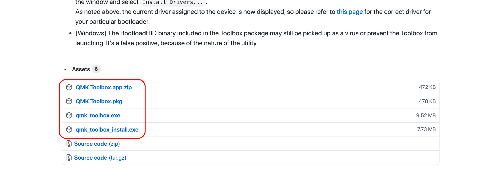
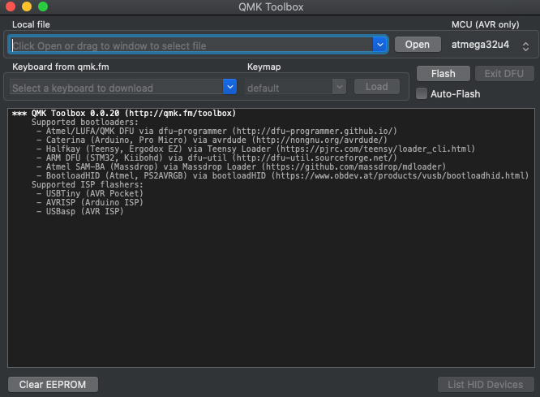
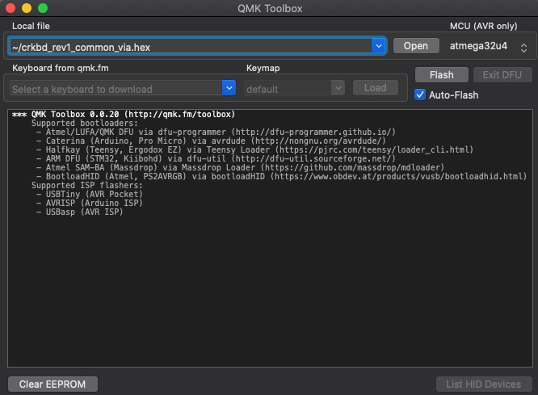
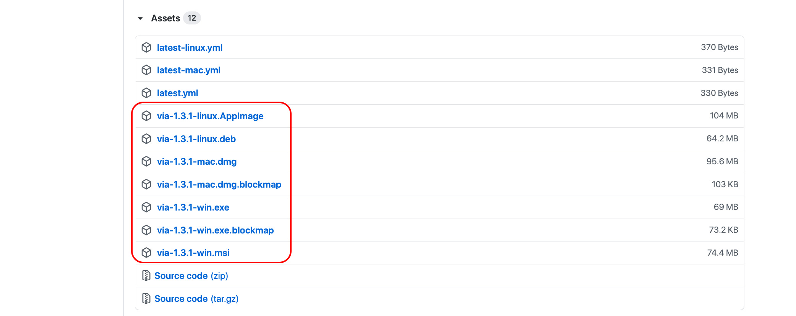
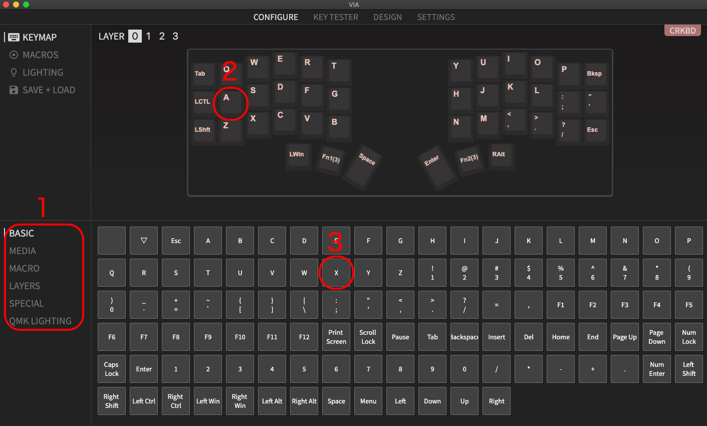
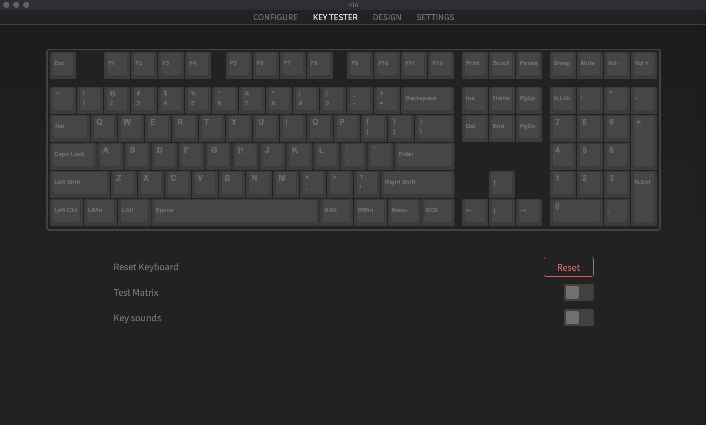
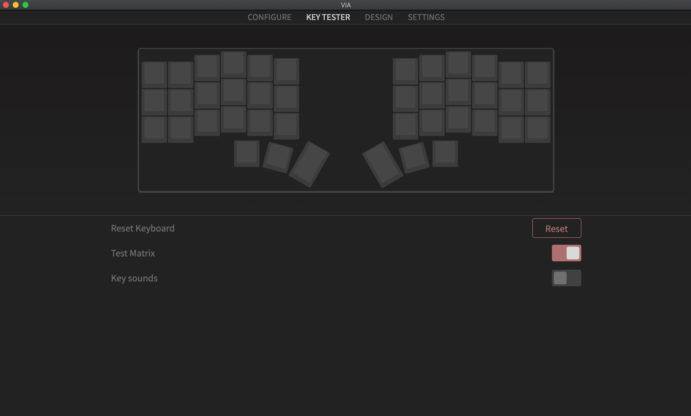
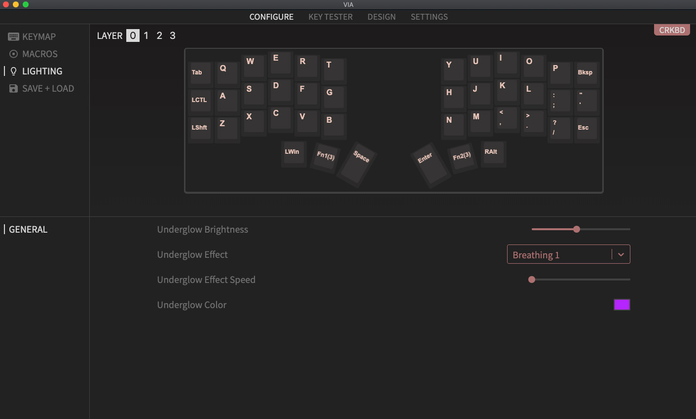

# ファームウェア

## ファームウェアの書き込み

ファームウェアの書き込み方法はいくつか用意されていますが、[QMK Toolbox](https://github.com/qmk/qmk_toolbox) を利用する方法が手軽です。

### QMK Toolbox のダウンロード
下記のURLから最新版の QMK Toolbox をダウンロードします。\
https://github.com/qmk/qmk_toolbox/releases/



ダウンロードしたファイルから QMK Toolbox をインストールします。\
インストール方法は各OSの指示に従ってください。

QMK Toolbox を開くと下記のようなウィンドウが表示されます。



### ファームウェアの書き込み

VIA用のファームウェアを下記よりダウンロードします。\
[crkbd_rev1_common_via.hex](https://github.com/foostan/qmk_firmware-hex/releases/download/release-20201208/crkbd_rev1_common_via.hex)

QMK Toolbox の 「**Open**」 からダウンロードしたファイルを指定します。\
また「**Auto-Flash**」のチェックボックスをチェックします。



この状態でキーボードをUSBで接続し、リセットボタンを押すとファームウェアの書き込みが始まります。\
下記のように書き込みのメッセージが表示されれば完了です。


片側のProMicroにファームウェアの書き込みが完了したら、もう片方も同じ手順で書き込みを行います。

### (オプション) 自分でファームウェアをビルドする場合

https://docs.qmk.fm/#/newbs_getting_started こちらを参照して頂き、ファームウェアを書き込む環境を用意します。

環境ができましたら、下記コマンドで Crkbd 用にファームウェアをビルドします。

```
make crkbd/rev1/common:via
```

ビルドが完了したら下記コマンドを実行します。

```
make crkbd/rev1/common:via:avrdude
```

実行すると下記のようなログがでて、`.` が増えていくことが確認出来ると思います。
この間にリセットスイッチを **2回** 押すとファームウェアの書き込みが完了します。
なおProMicroによって1回の場合もあります。

```
<省略>

Checking file size of crkbd_rev1_common_via.hex                                                        [OK]
 * File size is fine - 27328/28672
Copying crkbd_rev1_common_via.hex to qmk_firmware folder                                               [OK]
Detecting USB port, reset your controller now........
```

片側のProMicroにファームウェアの書き込みが完了したら、もう片方も同じ手順で書き込みを行います。

## キーマップの変更

Corne Keyboard は [VIA](https://caniusevia.com/) に対応しています。\
上記の手順で VIA 用のファームウェアを書き込むことで利用することできます。

### VIA のダウンロード
下記のURLから最新版の VIA をダウンロードします。\
https://github.com/the-via/releases/releases/



ダウンロードしたファイルから VIA をインストールします。\
インストール方法は各OSの指示に従ってください。

キーボードを接続した状態で VIA を開くと下記のようなウィンドウが表示されます。


### KEYMAP / CONFIGURE

この画面ではキーマップが変更できます。

変更可能なキーはいくつかの種類に分類されていて、「１」のエリアから探すことができます。
キーを変更する場合は「2」変更する場所をクリックし、「3」変更したいキーを選択します。
なお VIA では瞬時にキーマップが書き換わります。



### KEYMAP / TESTER

この画面ではキーマップの動作テストができます。

押したキーの色が変わることでキーが正しく設定されていることが確認できます。



Test Matrix ではキーボードの各スイッチの動作確認ができます。
実装後の動作確認はこちらで行ったほうがわかりやすいです。



### LIGHTING

この画面ではLEDのパターンや色の変更ができます。


